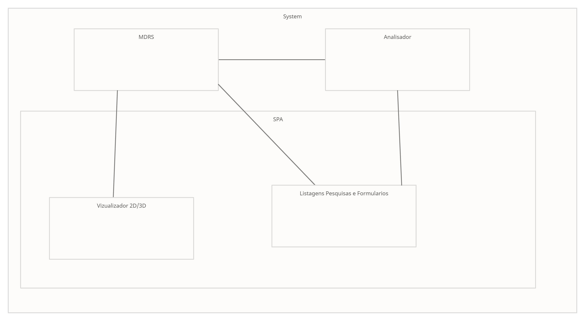
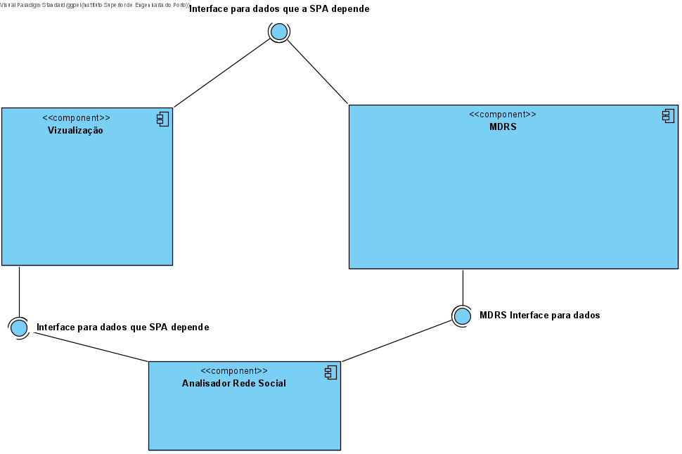

# Architecture Background

Foi utilizada uma arquitetura baseada em Onion, visto que é a mais fácil de *aumentar* no futuro, à medida que o sistema evolua ou haja a necessidade para tal.

Esta arquitetura foi aplicada no módulo MDRS e será futuramente aplicado ao módulo MDPC. 
Futuramente será abordado a arquitetura usada na aplicação SPA(Vizualicação).
## Problem Background

### System Overview

A empresa Graph4Social pretende um protótipo para um jogo baseado na visualização e manipulação
de grafos sociais que permite a gestão de pedidos de ligação, introduçã, amizades(ligações), postagens, comentário e 
a vizualização e consulta desses dados e também um serviço de analise de rede social.

### Context

A analsie de redes social é um tema bastante recorrente e a criação de um jogo
para tal oferece uma dinamica diferente das que estamos acostumados a observar.
A Graph4Social em parceria com o ISEP quer expandir seu portfólio de analise de redes
social para agora abrangir video-jogos. Dessa forma, a análise vai contar com alguns módulo
de visualização e analise como caminhos da rede social, conexões, pesos em caminhos e mais.

NB: Entretanto nesta edição do 5º semestre será solicitado um protótipo de um sistema de rede social
devido as limitações da unidade curricular e que assim, o projeto seja possível de desenvolver.

A empresa Graph4Social, que quer expandir seu portfólio na atuação de analise de redes social para jogos
vai abordar esse problema proposto para ser desenvolvido.

Este SAD serve de base para debate sobre o sistema a construir (a implementar, testar e implantar), e pretende-se que esteja alinhado com o sistema construído. Para além do óbvio na descrição duma arquitetura de software, deve identificar alternativas de design e ponto de variação.

### Driving Requirements
> This section lists the functional requirements, quality attributes and design constraints. It may point to a separate requirements document.

#### Functional Requirements
(Casos de uso, a compeltar)

* UC 9: Escolher quais “utilizadores objetivo” (sugeridos pelo sistema) o jogador recém registado gostaria de ter na sua rede.

* UC 11: Pedir introdução a utilizador objetivo.

* UC 12: Aprovar/desaprovar pedido de introdução.

* UC 3: Editar relacionamento com tags e força de ligação.

* UC 5: Editar perfil próprio.

* UC 6: Editar estado de humor.

* UC 7: consultar a rede a partir da sua perspetiva.

* UC 8: Registar utilizador no sistema.

* UC 10: Pesquisar utilizadores que conheça na rede, e pedir ligação de utilizador.

* UC 35: obter lista de pedidos de ligação pendentes

* UC 33: Aceitar ou rejeitar a introdução

* UC 17: Consultar o caminho mais forte (maximiza o somatório das forças de ligação) para determinado utilizador

* UC 18: Consultar o caminho mais curto (minimiza o número de ligações) para determinado utilizador

* UC 19: Consultar o caminho mais seguro (garante que não há uma força de ligação inferior a x considerando as forças nos dois sentidos da ligação) para determinado utilizador

* UC 9: Escolher quais “utilizadores objetivo” (sugeridos pelo sistema) o utilizador recém registado gostaria de ter na sua rede.

* UC 11: Pedir introdução a utilizador objetivo.

* UC 12: Aprovar/desaprovar pedido de introdução.

* UC 3: Editar relacionamento com tags e força de ligação.

* UC 5: Editar perfil próprio.

* UC 6: Editar estado de humor.

* UC 7: consultar a rede a partir da sua perspetiva.

* UC 8: Registar utilizador no sistema.

* UC 10: Pesquisar utilizadores que conheça na rede, e pedir ligação de utilizador.

* UC 35: obter lista de pedidos de ligação pendentes

* UC 33: Aceitar ou rejeitar a introdução

* UC 4: Consultar (o cálculo d) a força de ligação entre dois utilizadores/jogadores

* UC 15: Consultar Dimensão da rede – número de ligações até ao segundo nível

* UC 16: Consultar Fortaleza da rede – somatório da força de ligação da sua rede até ao primeiro nível

* UC 20: Consultar o tamanho da rede de um utilizador (até 3º nível – dois graus de separação)

* UC 21: Consultar o grafo de amigos comuns entre dois utilizadores

* UC 22b: Consultar leader board - fortaleza de rede

* UC 22a: Consultar leader board - dimensão de rede

* UC 23: Consultar dimensão da rede (número de utilizadores)

* UC 24: Consultar Tag cloud das tags de todos os utilizadores

* UC 25: Consultar Tag cloud das tags de todas as relações

* UC 26: Consultar sugestões de amigos

* UC 27: Consultar Tag cloud das tags do próprio utilizador

* UC 28: Consultar Tag cloud das tags de relações do próprio

* UC 13: Fazer post

* UC 14: Comentar post

* obter feed de posts de um utilizador

### Quality attributes

Os atributos de qualidade são categorizados e sistematizados segundo o modelo [FURPS+](https://pt.wikipedia.org/wiki/FURPS).

#### **Funcionalidade**
1. Cada sistema só poderá aceder aos dados que lhe dizem respeito.
2. Deve ser auditada e verificada a integridade da informação a que os sistemas acedem.
3. Com vista à necessidade de saber e necessidade de conhecer, toda a informação deve estar protegida de acessos indevidos. Ou seja, o princípio de minimização de acesso ao que é essencial para cada utilizador/aplicação, criação de túneis para transferência de informação, avaliação da integridade de dados e aplicações, e encriptação/minimização dos dados.
4. Uma vez que o módulo de gestão de encomendas se encontra virado para o exterior, é necessário ter especial atenção com a privacidade e proteção de dados à luz do RGPD. Assim é necessário que o sistema cumpra a legislação em vigor e, em especial, disponibilize as informações legais e informe o utilizador aquando do seu registo, bem como permita aceder e cancelar a sua conta nos casos e nas condições legalmente permitidas.

#### **Usabilidade**
5. A SPA deve permitir acesso a todos os módulos do sistema: master data rede social, master data posts e comentários, analisador de rede social e visualização, bem como RGPD.
6.  No âmbito do projeto atual, a administração de utilizadores pode ser efetuada diretamente na base de dados não sendo necessário um módulo de gestão de utilizadores.

#### **Confiabilidade (Reliability)**
7. O sistema deve estar operacional 24 horas por dia, isto é, o tempo de paragem deve ser nulo, salvo algum problema ou perda dos serviços externos ao sistema, como é o caso das bases de dados (MongoDB, Azure Server).
8. A estimativa de tempo, no qual o sistema deve estar operacional, é decisão do cliente. O sistema está preparado para existir perpetuamente.

#### **Desempenho (Performance)**
9. Os módulos MDRS e MDPC têm um tempo de resposta quase instantâneo. O MDRS pode ter uma performance um pouco mais lenta devido a implementação de redes muito grandes, dado que o EF demora para carregar todas as ligações e relações.

#### **Suportabilidade**
12. Embora não esteja no âmbito atual do projeto, deve ser levado em conta na arquitetura da solução, a extensão futura para aplicações móveis.

--------------------

### **Design Constraints**
1. Não foi solicitado pelo cliente um padrão de design para seguir.

### **Implementation constraints**
1. Todos os módulos devem fazer parte do código fonte da mesma SPA e serem disponibilizados como um único artefacto.

### **Interface constraints**
1.   A SPA deve permitir acesso a todos os módulos do sistema: master data rede, master data viagem, planeamento e visualização, bem como RGPD.
2.   O módulo de Analise de rede deve consumir dados de rede através da API do master data rede social.
4.   O módulo de Visualização deve consumir dados de rede através da API do master data rede social.
5.   O módulo de Visualização deve consumir dados de viagens através da API do master data publicações e cometários.
6.   O módulo de Visualização deve consumir dados da rede social através do Analisdor de Rede Social.

### **Physical constraints**
1.  Existem dois servidores em load balancing, onde estão instaladas as aplicações, serviços e as bases de dados e que se encarregam do armazenamento da informação.
2.  Existem ainda dois servidores em failover que distribuem os endereços a todos os sistemas e se encarregam da autenticação de sistemas e utilizadores (DHCP, DNS (se aplicável) e autenticação de servidores, e eventualmente um servidor Kerberos).
3.  Na demonstração do protótipo é obrigatório recorrer aos servidores virtuais criados para o efeito.
4.  O Serviço MDRs será hospedado em servidores Azure.

------------------

### **Principais Funcionalidades**

De um modo geral, as principais funcionalidades de cada módulo são as seguintes:

- **Master Data Rede Social** – permite a gestão da informação relacionada com a rede (nós, percursos), tipos de viaturas, tipos de tripulantes, linhas e viagens.
- **UI** – interface com o utilizador.
- **Analisador de Rede Social** – com base nos percursos existentes planear as trocas de motoristas nos pontos de rendição. Planear os serviços de tripulantes com base nos serviços de viatura. Consome a informação gerida no módulo master data e publica informação do planeamento para o módulo de visualização.
- **Visualizador 3D/2D** –  permite a visualização 2D e 3D da rede, a navegação pela cena e a consulta gráfica de informação sobre as viagens. Consome a informação gerida no módulo master data e no módulo.
- **Clientes + RGPD** – gestão de informação dos utilizadores finais “clientes” e seus consentimentos no âmbito do RGPD.

No âmbito do projeto atual, a administração de utilizadores pode ser efetuada diretamente na base de dados não sendo necessário um módulo de gestão de utilizadores.

-------------------

## Solution Background

### Integrated Solution

### Walking Esqueleton

- Vizualização da Rede- SPA consome um jogador como nó central e uma lista de lista, onde esão
suas ligações e as ligações de suas ligações. O objeto fica com o seguinte formato: 
  Jogador, Lista de ligacoes, em que o objeto jogador carrega o nome do nó central e a lista de ligacoes carrega o nome do no a ser ligado e a lista das ligacoes daquele nó, sendo essa lista
  recursiva, ou seja, carrega outros objetos de ligacoes com nome e lista de ligacoes.

- SPA consome dados através de requisições ao MDRS em que todas elas devem constar
o identificador único para futuras pesquisas, alterações e integrações.
  Cada caso de uso faz pedido dos dados que lhe dizem respeito, ou seja, é necessáario criação de dtos
  para o envio dos dados solicitados.
  
- Analisador de rede social consome os dados dos jogadores, mais especificamente
o id, nome, as tags de definição do perfil e suas ligações. Dessa forma, para atribuir as ligações
  ao modolu do analisador, as ligacoes devem ser criadas com o id do primeira jogador, id do segundo jogador, a forca da primeira direcao(id 1 ao id 2), forca da 2 direcao(id 2 ao id 1).
  
- SPA também utiliza de algoritmos implementados no analisador que deverá disponibilizar
listas com nomes de jogadores que representam caminhos(seguro, curto e mais forte) e sugestões de jogadores.
  
### **Architectural Approaches**

Baseado nos requisitos não funcionais e restrições de design, serão adotadas as seguintes abordagens/padrões/estilos:

- Client-Server, porque cada um dos "módulos" MDRS, MDPC, Analisador de Rede social são aplicações servidoras de outras aplicações clientes;
- Web Application, em que o frontend é desempenhado por uma SPA (Single Page Application), e que o backend é desempenhado pelos módulos MDRS, MDPC e Analisador de Rede Social;
- SOA, porque os servidores (cf. anterior) deverão disponibilizar APIs, e particularmente APIs para serem usadas na web, disponibilizando serviços para os clientes respetivos. Serão adotados os nível 0, 1 e 2 do [Modelo de Maturidade de Richardson](https://martinfowler.com/articles/richardsonMaturityModel.html) aplicado a REST;
- N-Tier, pois as várias aplicações devem ser implantadas em diferentes máquinas *on premises* e IaaS e PaaS (*on cloud*), de acordo com os requisitos não funcionais;
- Layered architecture, mais especificamente Onion Architecture, por razões académicas.
- SPA a definir.

Outras abordagens/estilos/padrões, como por exemplo a interligação entre aplicações baseado em mensagens-eventos foram desconsideradas para não violar os requisitos e restrições definidos, mas também por questões académicas.

### **Analysis Results**
Não existem por agora resultados de análise ou avaliação. Estudos qualitativos acerca dos estilos/padrões adotados (nomeadamente Onion em MDR e MDV, mas também Dependency Injection na UI), permitem empiricamente advogar que a manutenibilidade, evolutabilidade e testabilidade do software são elevadas, ao mesmo tempo que permitem atingir as funcionalidades desejadas.